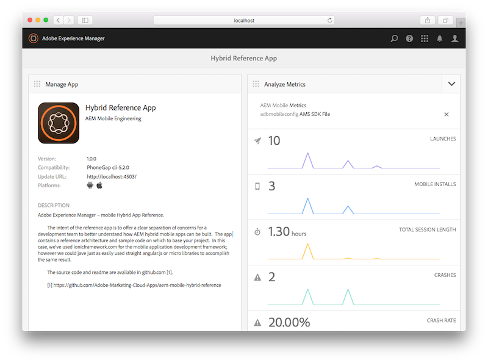
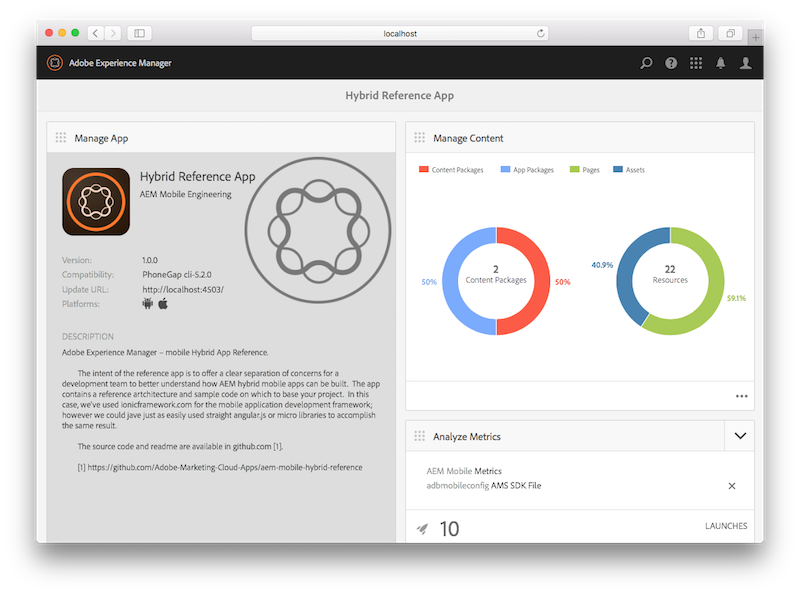

# AEM Mobile Dashboard Customizations

Every mobile app has its own set of unique requirements. 
The AEM Mobile dashboard is a powerful tool that can be leveraged in order to ensure every mobile app can be managed as efficiently as possible.

### You can go from this...

### ...to this!


This project provides serveral customizations that can be applied to an app's [AEM Mobile](https://aemmobile.adobe.com) Dashboard.

The [AEM Mobile Hybrid Reference App](https://github.com/Adobe-Marketing-Cloud-Apps/aem-mobile-hybrid-reference) will be used for example purposes throughout this project but the customizations presented can be applied to any AEM Mobile app.

## Presentations

AEM Mobile dashboard customizations has been presented at the following events.

- [EVOLVE](http://evolve.3sharecorp.com/): Do You Want to Build a Dashboard?  (Aug. 30, 2016) ([slides](http://www.slideshare.net/arumsey/do-you-want-to-build-a-dashboard) )

## Minimum requirements

1. Maven (tested: Apache Maven `3.2.2`)
2. Git (tested: git version `2.3.2`)
6. AEM 6.2

## Install AEM Package

    mvn -PautoInstallPackage clean install
 
# Customizations

## Instance Resource Type

The resourceType given to your mobile app instance drives the entire dashboard experience. Extending the core mobileapps resourceType provides a convenient way to alter existing dashboard functionality.

Core Instance Type: `/libs/mobileapps/core/components/instance`
PhoneGap Instance Type: `/libs/mobileapps/phonegap/components/instance`
Custom Instance Type: `/apps/arumsey/mobileapps/components/instance`

### Catalog Card

Each app instance component may override the default [card](content/jcr_root/apps/arumsey/mobileapps/components/instance/card.jsp) rendering used by the Catalog view. 

### App Details Dialog

The [dialog](content/jcr_root/apps/arumsey/mobileapps/components/instance/_cq_dialog/.content.xml) used by the App Details view can be completely altered to meet an app's specific requirements. 
- You don't want to expose app store properties? Remove it! 
- You have specific meta data that needs to be stored with your app? Add a new dialog tab!
- The possibilities are endless.

### App Template

The [app template](content/jcr_root/apps/arumsey/mobileapps/templates/app-hybrid-custom) will allow any new app that is created to automatically obtain any desired dashboard customizations.

## Dashboard Configuration

Each mobile app instance in AEM can specify its own dashboard tile configuration. This can include removing or replacing default tiles as well as adding new tiles. The `pge-dashboard-config` property needs to be added to the `jcr:content` of your app's instance node (ie. shell).

eg.

    /content/mobileapps/hybrid-reference-app/shell/jcr:content
      + pge-dashboard-config = /apps/arumsey/mobileapps/dashboard/custom 

The dashboard configuration node can include new tile definitions as child nodes or specify a `tiles` multi-value property that includes paths to tile definitions.

## Custom Tiles

Now it is time to be creative. Dashboard tiles are meant to provide an immediate snapshot on the state of your app.
- How many pages are currently staged?
- Is the app part of a workflow?
- How many users does the app have?

Any functionality your app requires can be represented by a tile to ensure it can be managed efficiently.

### Tile Definition

Each [tile](content/jcr_root/apps/arumsey/mobileapps/tiles/content/.content.xml) is a `cq:Page` with a resourceType of `mobileapps/gui/components/dashboard/tile`. 
Each tile needs to define a `layout`, `header`, `body` and `footer` child node.

#### Layout

No customizations should be required on this node but it is required in order for the entire tile to be rendered correctly in the dashboard.

```
    <layout
        jcr:primaryType="nt:unstructured"
        sling:resourceType="mobileapps/gui/components/dashboard/layouts/tile"/>
```

#### Header

The header can contain a `title` and `actions`.

```
    <header jcr:primaryType="nt:unstructured">
        <title
            jcr:primaryType="nt:unstructured"
            jcr:title=""/>
        <actions
            jcr:primaryType="nt:unstructured"
            sling:resourceType="mobileapps/gui/components/dashboard/tile/actions">
            <items jcr:primaryType="nt:unstructured">
            ...
            </items>
        </actions>
    </header>
```

#### Body

The `body` node is generally where the bulk of the custom tile will be implemented. The `resourceType` of the body node should provide the full tile rendering.

```
    <body
        jcr:primaryType="nt:unstructured"
        sling:resourceType="">
    </body>
```

#### Footer

The `footer` of the tile definition provides the ability to request a new URL that the tile content is generally realted to. This could be tohught of as an expanded view which the tile provides a snapshot to.

```
    <footer
        jcr:primaryType="nt:unstructured"
        href=""/>
```
